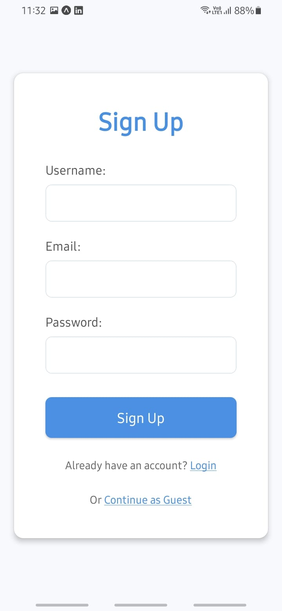
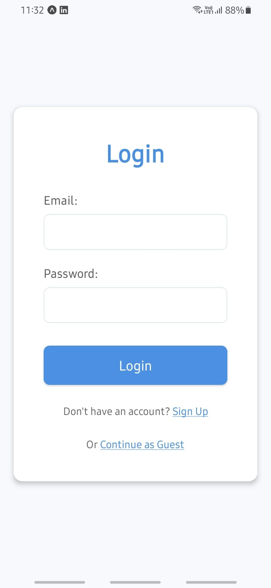
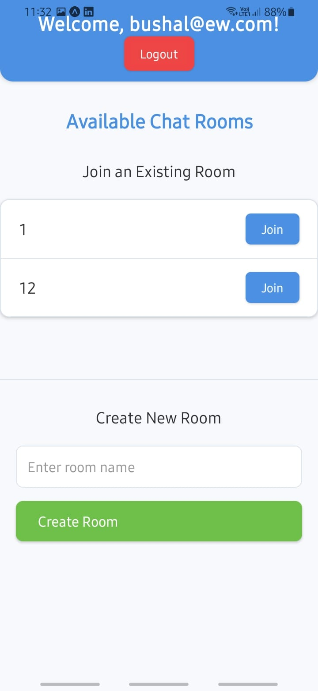
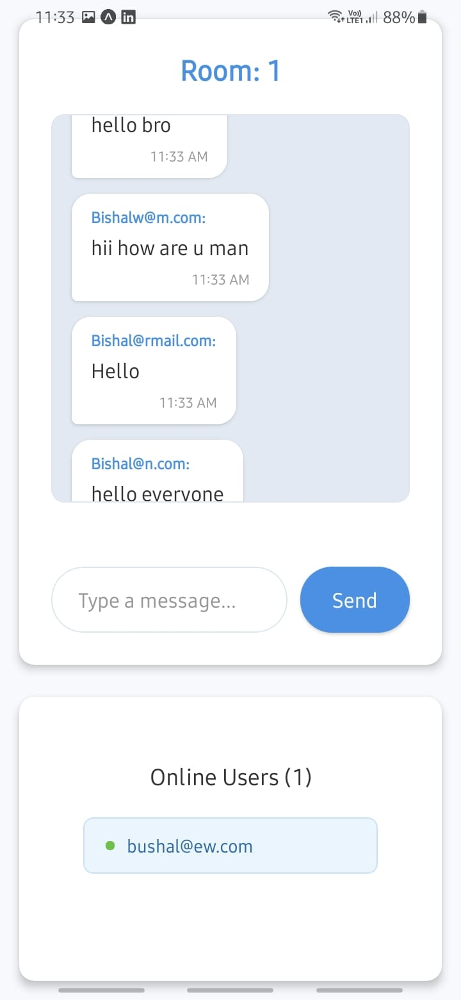

📱 Messaging App - React Native + Expo

A modern and fully functional **Messaging App** built with **React Native** and **Expo**, offering real-time chat, authentication, and a smooth user interface.

---

## ✨ Features

- 🔐 User Authentication (Sign In / Sign Up)
- 💬 Real-time Messaging
- 🧑‍🤝‍🧑 Online Users List

## 🚀 Installation

1. **Clone the Repository**

```bash
git clone https://github.com/yourusername/messaging-app.git
npm install
npm install -g expo-cli
```

To run the code
```bash
npm start
```





